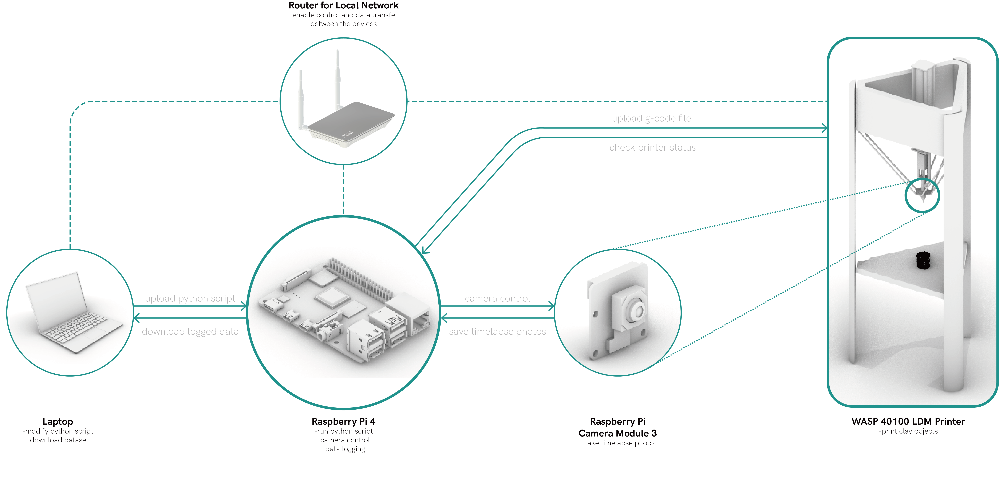

# MudTracker3D
Accompanying code to CORE 2024 project: "MudTracket3d- Clay 3d printing extrusion monitoring and auto-calibration using Machine Learning"

### Folders: 
## 1. Data collection 
This folder contains the codes to connect the system setup with raspberry pi and the WASP printer in order to create our dataset. Following illustration shows our setup for dataset collection:

Data Visualization folder contains all the codes used to visualize the data into graphs for presentation
Data folder has class definitions to transform and prepare splitted dataset for machine learning
Model folder contains the Machine learning network

Files:
train_config.py contains the training settings- hyperparameters for training the model
train.py is the code to run for training the model
samples.py is to be used to predict the parameter values for a given image(testing). This uses a checkpoint saved after the model is trained.
test.py sets the seed for training and calls the classes.

Reference readmes contain the library requirements and the lisence data from 'https://github.com/cam-cambridge/caxton' - to be modified at the end based on our project.
